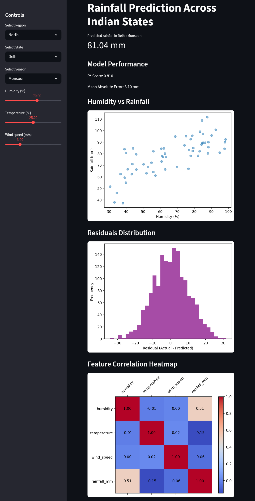
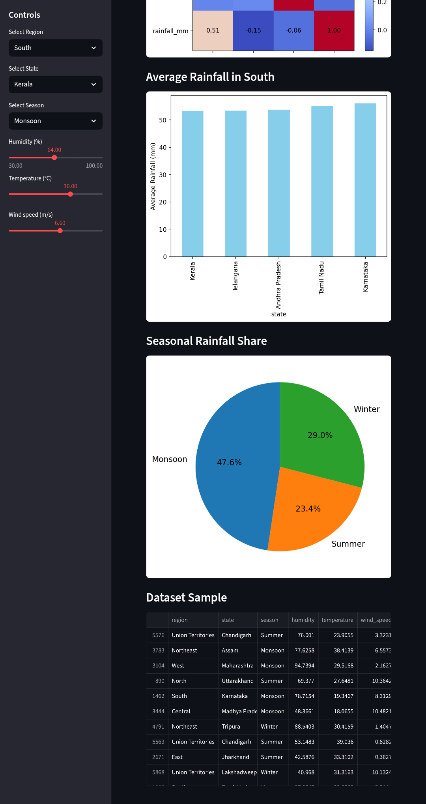

# 🌧️ Rainfall Prediction Across Indian States

[](https://rainfall-prediction-using-logistic-regression-uwytqfuawnth26wx.streamlit.app/#model-performance)
[](LICENSE)
[](https://www.python.org/)
[](https://github.com/Gyanankur23)

---

## 📌 Overview

This project predicts rainfall across Indian states using a linear regression model trained on synthetic but realistic weather data. It features an interactive Streamlit dashboard with region/state/season selectors, sliders for weather conditions, and dynamic visualizations.

---

## 🚀 Live Demo

👉 [Click here to explore the dashboard](https://rainfall-prediction-using-logistic-regression-uwytqfuawnth26wx.streamlit.app/#model-performance)

---

## 📸 Demo Screenshots

### Delhi — Monsoon Season  


### Kerala — Monsoon Season  


---

## 🧠 Features

- 🔄 Interactive controls: Region, State, Season, Humidity, Temperature, Wind Speed  
- 📊 Real-time rainfall prediction  
- 📈 Model performance metrics: R² Score, MAE  
- 📉 Residuals distribution  
- 🔥 Correlation heatmap  
- 📊 Bar chart: Average rainfall by state  
- 🥧 Pie chart: Seasonal rainfall share  
- 🧾 Dataset preview

---

## 🏗️ Project Structure

```
rainfall-prediction/
├── app.py                  # Main Streamlit app
├── requirements.txt        # Python dependencies
├── demo-images/            # Screenshots for README
│   ├── 0.png
│   └── 00.png
├── README.md               # Project documentation
└── LICENSE                 # MIT License
```

---

## 📦 Installation

```
git clone https://github.com/your-username/rainfall-prediction.git
cd rainfall-prediction
pip install -r requirements.txt
streamlit run app.py
```

---

## 📚 Requirements

```
streamlit==1.38.0
scikit-learn==1.4.2
pandas==2.2.2
numpy==1.26.4
matplotlib==3.8.4
```

---

## 📈 Model Details

- Algorithm: Linear Regression  
- Inputs: Humidity, Temperature, Wind Speed, Region, State, Season  
- Output: Predicted Rainfall (mm)  
- Training: Synthetic dataset with 50–60 samples per state-season combination  
- Encoding: One-hot for categorical features

---

## 📝 License

This project is licensed under the MIT License. See the LICENSE file for details.

---

## 🙌 Acknowledgments

Built with ❤️ by Gyanankur Baruah  
Inspired by India's diverse climate and the power of data storytelling.
